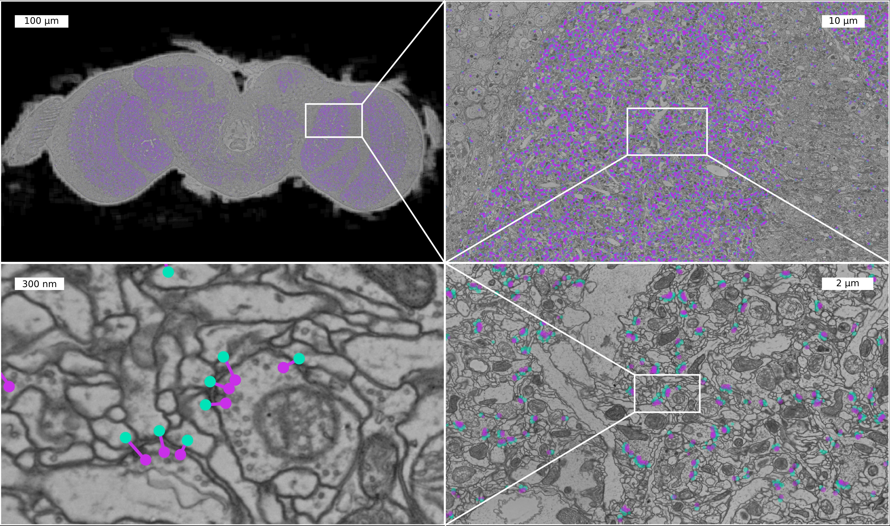

# Automatic Detection of Synaptic Partners in a Whole-Brain Drosophila EM Dataset

## Overview

This repository serves as an entry point for accessing and interacting with
predicted synaptic partners in the full adult fly brain (FAFB) dataset  [Zheng et al. 2018].



Details about the method can be found in our [bioRxiv preprint](https://www.biorxiv.org/content/10.1101/2019.12.12.874172v2).

If you are interested in

- using predicted synapses for circuit reconstruction in CATMAID, see the
  [CircuitMap](https://github.com/catmaid/circuitmap) application

- explore synapses linked to google's neuron segmentation in [neuroglancer](https://neuroglancer-demo.appspot.com/fafb.html#!gs://fafb-ffn1/main_ng.json)

- downloading all 244 million predicted synaptic connections in FAFB, see [this
  SQL dump](https://cremi.org/static/data/20191211_fafbv14_buhmann2019_li20190805.db)
  and use our circuit query library [`SynfulCircuit`](https://github.com/funkelab/synfulcircuit) to analyze the data (a good starting point is this [example jupyter notebook](https://github.com/funkelab/synfulcircuit/blob/master/examples/synful_fafb_query_circuit.ipynb))

- using our evaluation data to compare your own synapse prediction method, see this [section](Benchmark-dataset-and-evaluation)

- training and/or predicting on your own data, go to the [synful repository](https://github.com/funkelab/synful)!

Please don't hesitate to open
an issue or write us an email ([Julia
Buhmann](mailto:buhmannj@janelia.hhmi.org) or [Jan
Funke](mailto:funkej@janelia.hhmi.org)) if you have any questions!

## System Requirements
- Hardware requirements
  - No special hardware requirements - standard computer with enough RAM (~ 8 GB, of course: more is always better).
- Software requirements
  -  Software has been tested on Linux (Ubuntu 16.04)

## Installation Guide
Scripts in this repository (evaluation/*.py) for evaluation depend on the synful package. Please install from [synful repository](https://github.com/funkelab/synful). Installation takes ~ 3 min.


## Benchmark dataset and evaluation

### Ground-truth datasets

- Neuron skeletons are available in `evaluation/data/gt_skeletons/<brain_region>_skeletons.json`
- Ground-truth synaptic links are available in `evaluation/data/<brain_region>full_gt.json`

| Dataset | Connection count |     Brain Region     | Source                                             |
|---------|------------------|:--------------------:|:----------------------------------------------------:|
| InCalyx   |      59,155      |     calyx     | [Zheng, Li et al. (2020)](https://www.biorxiv.org/content/10.1101/2020.04.17.047167v2.abstract) (Bock Lab) |
| OutLH   |      11,429      |     lateral horn     | [Bates, Schlegel et al. (2020)](https://www.biorxiv.org/content/10.1101/2020.01.19.911453v1.abstract) (Jefferis Lab) |
| InOutEB |      61,280      |    ellipsoid body    | [Turner-Evans et al. (2019)](https://www.biorxiv.org/content/10.1101/847152v1.abstract) (Jayaraman Lab)         |
| InOutPB |      14,779      | protocerebral bridge |"|

For more details on the datasets, please refer to our preprint, Table 1 and section `3.4.1 Evaluation:Datasets`.

### Evaluation

Evaluation code depends on the synful package. Please install from [synful repository](https://github.com/funkelab/synful).

We also added our predicted synful-synapses as example files.
Run evaluation on synful-synapses:
```shell
cd evaluation
python run_evaluate.py configs/pb_eval.json
```
This should output:
```
final fscore 0.59
final precision 0.62, recall 0.57
```

Evaluation runtime of above code is ~1 minute.

To test your own predicted synapses:

1) Predict synapses in the three brain regions in FAFB for which ground-truth is available. Get the raw data for example via cloudvolume, for an example see this [section](Download-the-raw-data-with-cloudvolume)
2) Map predicted synapses onto ground-truth skeletons provided in this repository
3) Write synapses out into the here required format, see this [section](Synapse-Format)
4) Adapt the config file and replace `pred_synlinks` with your predicted synapse-filepath (this [line](https://github.com/funkelab/synful_fafb/blob/master/evaluation/configs/eb_eval.json#L2) in the config file).

##### Synapse Format
Synapses are stored in a json file, each synapse is represented with:
```python
{"id": 822988374080568,
"id_skel_pre": 4429537,
"id_skel_post": 4210786,
"location_pre": [89200, 159400, 512924],
"location_post": [89200, 159412, 512816],
"score": 8.599292755126953
```
See [this file](https://raw.githubusercontent.com/funkelab/synful_fafb/master/evaluation/data/ebfull_gt.json) for an example of predicted synapses stored in the required format.
Locations are provided in physical units (nm) and z,y,x order.

##### Neuron Format
Neurons are represented with a list of nodes. One example node:
```python
{"id": 1760159,
"position": [171240, 157706, 482924],
"neuron_id": 1274114,
"parent_id": 19713274}
```
See [this file](evaluation/data/gt_skeletons/eb_skeletons.json) for an example of ground truth neurons.
Locations are provided in physical units (nm) and z,y,x order.

##### Download the raw data with cloudvolume
install cloudvolume from: https://github.com/seung-lab/cloud-volume/tree/master

After installation, you can download the data:

```python
from cloudvolume import CloudVolume
CLOUDVOLUME_URL = 'precomputed://gs://neuroglancer-fafb-data/fafb_v14/fafb_v14_orig'
cv = CloudVolume(CLOUDVOLUME_URL, use_https=True)
data = cv[<x1>:<x2>, <y1>:<y2>, <z1>:<z2>]
```

##### Visualization with neuroglancer
If you want to have a quick look at the data, there is a [script](evaluation/data/visualize_data_with_neuroglancer.py) that you just need to run from inside the repository:

Example usage, if you want to visualize the ground truth data for skeleton id 607812 in EB.
```
cd evaluation/data
python -i visualize_data_with_neuroglancer.py gt_skeletons/eb_skeletons.json ebfull_gt.json 607812
```

or if you want to have a look at our synapse predictions mapped onto the same skeleton.

```
python -i visualize_data_with_neuroglancer.py gt_skeletons/eb_skeletons.json synful_predictions/ebfull_pred.json 607812
```
